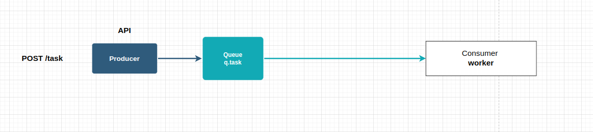
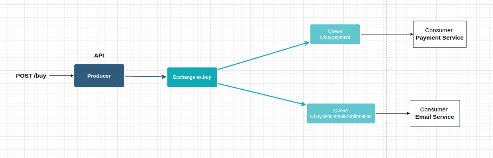
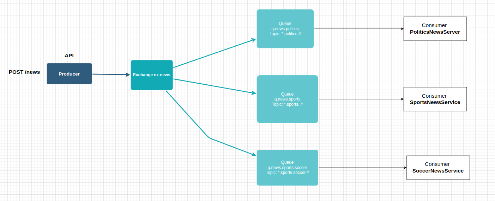
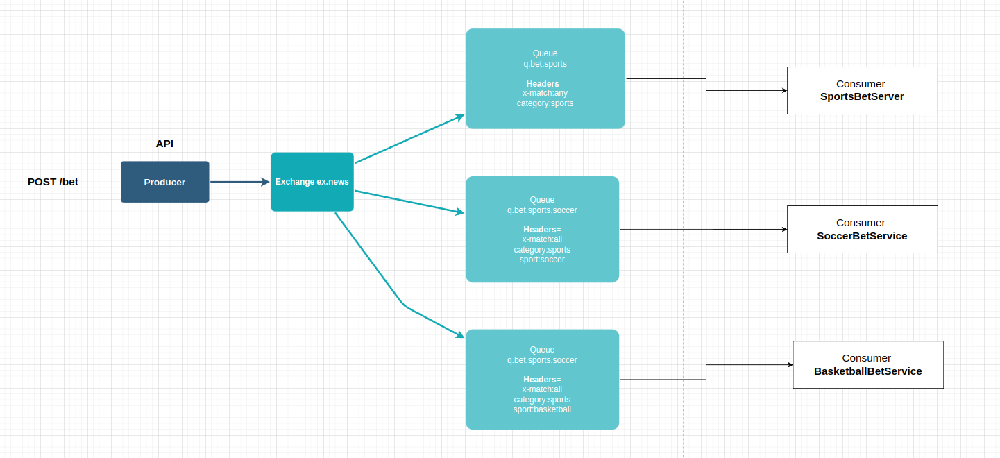

# Sobre projeto
Este projeto foi desenvolvido com o objetivo de estudar o serviço de mensageria disponibilizado pelo RabbitMQ
O objetivo primário é implementar algumas comunicações padrão, utilizando as filas do RabbitMQ e linguagem NodeJS (o foco não é na aplicação em si, por isso apenas adicionei a lógica necessária para demonstrar o funcionamento dos principais tipos de exchange e filas do RabbitMQ). 
Serão abordados alguns exemplos de consumo de mensagem direto da fila, e alguns padrões de publisher/subscribe.

## Produzindo as mensagens e consumindo as filas
A collection do Postman com as resquisições estão disponíveis em files/RabbitMQ-Examples.postman_collection.json

### Rodando o RabbitMQ
Primeiramente é necessário subir o servidor do RabbitMQ na sua máquina, para isso é possível utilizar o docker que já está pré configurado através do docker-compose.yml na raiz do projeto, para subir o container com o servidor basta executar na raiz do projeto

`docker-compose up`
Por default o painel de gerenciamento do RabbitMQ irá estar disponível na porta 15672 (localhost:15672). 
O usuário e senha default para acessar o painel são 'guest'.

### Executando os exemplos
Primeiramente é necessário subir o serviço da webapi.js que irá receber a requisição e enviar para as respectivas filas. para iniciar o servidor entrar em /application e executar
`node webapi.js`

#### Direct Message
Envio é feito diretamente para uma fila e o consumer le a mensagem e caso confirme a mesma é apagada da fila.

###### Publicando a mensagem
Para enviar a mensagem no postman a requisição está disponível na pasta "Task (Direct message)"
######Consumindo a mensagem
Executar o consumer disponível na pasta application/direct_message com o comando `node task-server.js` O resultado será exibido no console
#### Padrões pub/sub:
##### Fanout Exchange
O envio é feito para a exchange e todas as filas que façam parte da exchange recebem uma cópia da mensagem enviada.

###### Publicando a mensagem
Para enviar a mensagem no postman as requisições estão disponíveis na pasta "Buy (Fanout Exchange)"
######Consumindo as mensagens
Executar os consumers disponíveis na pasta application/direct_message com os comandos
`node email-server.js`
`node payment-server.js`
 O resultado será exibido no console

##### Topic Exchange
O envio é feito para a exchante e todas as filas que tiverem "assinado" ao tópico irão receber uma cópia da mensagem enviada.

###### Publicando a mensagem
Para enviar a mensagem no postman as requisições estão disponíveis na pasta "News (Topic exchange)"
######Consumindo as mensagens
Executar os consumers disponíveis na pasta application/topic_exchange com os comandos
`node politics-news-server.js`
`node sports-news-server.js`
`node sports-soccer-news-server.js`
 O resultado será exibido no console

##### Headers Exchange
O envio é feito para a exchange e todas as filas que correspondam aos parâmetros definidos no header irão receber uma cópia da mensagem enviada.

###### Publicando a mensagem
Para enviar a mensagem no postman as requisições estão disponíveis na pasta "Bet services (Headers Exchange)"
######Consumindo as mensagens
Executar os consumers disponíveis na pasta application/header_exchange com os comandos
`node basketball-bet-server.js`
`node soccer-bet-server.js`
`node sports-bet-server.js`
 O resultado será exibido no console

